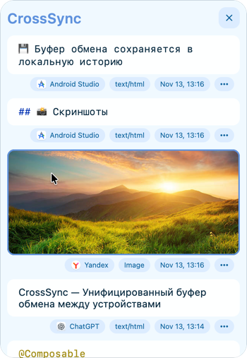

# 🚀 CrossSync — Unified Clipboard Across Devices

**CrossSync** is a cross-platform application designed to synchronize the clipboard between computers and mobile devices within a local network.  
The program provides fast and secure sharing of text, links, images, and files without relying on cloud services.  
Support for **formatted HTML text** is included, preserving the original formatting.

---

## 💡 Current Status
- 📋 macOS version implemented
- 💾 Clipboard data is saved in a local history
- 🖼 Supports **images**, **files**, and **HTML text**
- 🪟 A window is available, accessible from the system tray or by pressing **Ctrl + Command + V**
- 👆 Items from history can be selected and reinserted into the active application with a double-click

---

## 🧭 Planned Development
- 📱 Android client implementation
- 🪟 Support for **Windows** and **Linux**
- 🔄 Clipboard synchronization between devices over the local network
- 🧠 Extended history features: search, filters, pinning items
- ⚙️ Interface and hotkey customization
- 🔒 Enhanced privacy and access control options

---

## 📸 Screenshots

---

## 📦 Download and Installation
🧱 The application is currently under development.
- macOS: *(link to .dmg will be added)*
- Android: *(in development)*

---

## ✅ ToDo
- [x] Clipboard for macOS
- [ ] Implement synchronization over the local network
- [ ] Develop Android client
- [ ] Support for Windows and Linux
- [ ] Advanced filters and search in clipboard history
- [ ] Window and hotkey customization
- [ ] User interface and experience improvements
- [ ] Privacy settings and data storage management

---

## 👨‍💻 Author
Development by **[Maxim](https://github.com/MaximDvinov)**  
📄 License — MIT  
💬 The project is actively under development
